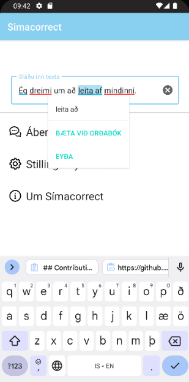
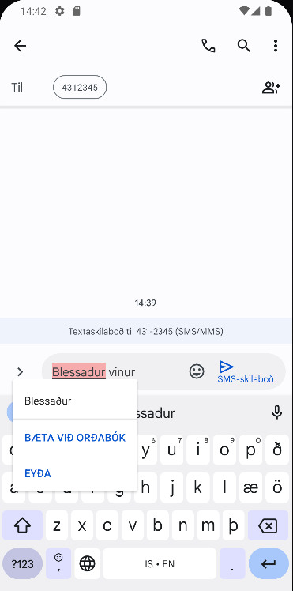

# Simacorrect

This project provides an Icelandic spell checker service for android.

    

## Introduction
TODO:

## Features
- #### Supports correction for grammar errors for android version 12.0 and higher
    - This covers grammar, compound, punctuation and phrasing errors as well as spelling suggestions based on context.
- #### Correction for spelling errors
    - This covers spelling, capitalization and abbreviation errors.

## Screenshots

## Contributing

You can contribute to this project by forking it, creating a branch and opening a new
[pull request](https://github.com/grammatek/simacorrect/pulls).

## License

All new code is Copyright © 2022 Grammatek ehf and licensed under the [Apache License](LICENSE).

This software is developed under the auspices of the Icelandic Government 5-Year Language Technology Program, described
[here](https://www.stjornarradid.is/lisalib/getfile.aspx?itemid=56f6368e-54f0-11e7-941a-005056bc530c) and
[here](https://clarin.is/media/uploads/mlt-en.pdf) (English).